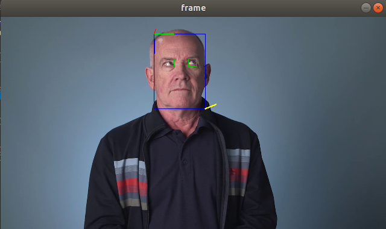

# Computer Pointer Controller

This is eye gaze mouse controller application with OpenVino.

Used 4 OpenVino models

 - Face Detection
     Detect Face position in the frame 
 - Head Pose Estimation
     Estimate Head pose angles for gaze estimation
 - Facial Landmarks Detection
     Left and Right eye detection for gaze estimation
 - Gaze Estimation Model
     Gaze estimate from head pose and eye images

## Project Set Up and Installation

### Download models

    cd /opt/intel/openvino_2021/deployment_tools/tools/model_downloader
     ./downloader.py --name face-detection-adas-0001 -o /home/ubuntu/udacity/edigeAi/EdgeAIND-computer-pointer-controller/models
     ./downloader.py --name head-pose-estimation-adas-0001 -o /home/ubuntu/udacity/edigeAi/EdgeAIND-computer-pointer-controller/models
     ./downloader.py --name gaze-estimation-adas-0002 -o /home/ubuntu/udacity/edigeAi/EdgeAIND-computer-pointer-controller/models

### Install pyautogui
     python3 -m pip install pyautogui
     
     sudo apt-get install scrot

     sudo apt-get install python3-tk

     sudo apt-get install python3-dev

### Directory structure
    
    .
    ├── bin
    │   └── demo.mp4
    ├── models
    │   └── intel
    │       ├── face-detection-adas-0001
    │       │   ├── FP16
    │       │   │   ├── face-detection-adas-0001.bin
    │       │   │   └── face-detection-adas-0001.xml
    │       │   ├── FP16-INT8
    │       │   │   ├── face-detection-adas-0001.bin
    │       │   │   └── face-detection-adas-0001.xml
    │       │   └── FP32
    │       │       ├── face-detection-adas-0001.bin
    │       │       └── face-detection-adas-0001.xml
    │       ├── gaze-estimation-adas-0002
    │       │   ├── FP16
    │       │   │   ├── gaze-estimation-adas-0002.bin
    │       │   │   └── gaze-estimation-adas-0002.xml
    │       │   ├── FP16-INT8
    │       │   │   ├── gaze-estimation-adas-0002.bin
    │       │   │   └── gaze-estimation-adas-0002.xml
    │       │   └── FP32
    │       │       ├── gaze-estimation-adas-0002.bin
    │       │       └── gaze-estimation-adas-0002.xml
    │       ├── head-pose-estimation-adas-0001
    │       │   ├── FP16
    │       │   │   ├── head-pose-estimation-adas-0001.bin
    │       │   │   └── head-pose-estimation-adas-0001.xml
    │       │   ├── FP16-INT8
    │       │   │   ├── head-pose-estimation-adas-0001.bin
    │       │   │   └── head-pose-estimation-adas-0001.xml
    │       │   └── FP32
    │       │       ├── head-pose-estimation-adas-0001.bin
    │       │       └── head-pose-estimation-adas-0001.xml
    │       └── landmarks-regression-retail-0009
    │           ├── FP16
    │           │   ├── landmarks-regression-retail-0009.bin
    │           │   └── landmarks-regression-retail-0009.xml
    │           ├── FP16-INT8
    │           │   ├── landmarks-regression-retail-0009.bin
    │           │   └── landmarks-regression-retail-0009.xml
    │           └── FP32
    │               ├── landmarks-regression-retail-0009.bin
    │               └── landmarks-regression-retail-0009.xml
    ├── README.md
    ├── requirements.txt

## Demo
    #with video file 
    python3 main.py -i ../bin/demo.mp4 -s True

    #with camera
    python3 main.py -i cam -s True 

## Documentation
    
        usage: main.py [-h] -i INPUT [-l CPU_EXTENSION] [-d DEVICE]
               [-pt PROB_THRESHOLD] [-s SHOW]
               [--facedetectionmodel FACEDETECTIONMODEL]
               [--headposeestimationmodel HEADPOSEESTIMATIONMODEL]
               [--landmarksregressionmodel LANDMARKSREGRESSIONMODEL]
               [--gazeestimationmodel GAZEESTIMATIONMODEL]

        optional arguments:
        -h, --help            show this help message and exit
        -i INPUT, --input INPUT
                                path to video file or 'cam' for live feed
        -l CPU_EXTENSION, --cpu_extension CPU_EXTENSION
                                MKLDNN (CPU)-targeted custom layers.Absolute path to a
                                shared library with thekernels impl.
        -d DEVICE, --device DEVICE
                                Specify the target device to infer on: CPU, GPU, FPGA
                                or MYRIAD is acceptable. Sample will look for a
                                suitable plugin for device specified (CPU by default)
        -pt PROB_THRESHOLD, --prob_threshold PROB_THRESHOLD
                                Probability threshold for detections filtering(0.5 by
                                default)
        -s SHOW, --show SHOW  Display video image
        --facedetectionmodel FACEDETECTIONMODEL
                                path to Face detection model file
        --headposeestimationmodel HEADPOSEESTIMATIONMODEL
                                path to head pose estimation model file
        --landmarksregressionmodel LANDMARKSREGRESSIONMODEL
                                path to landmarks regression model file
        --gazeestimationmodel GAZEESTIMATIONMODEL
                                path to gaze estimation model file

## Benchmarks

### Model loading time 

| Model precision | Facedetection       | Head pose estimation | Facial landmarks detection | Gaze estimation model load tim | SUM                 |
|-----------------|---------------------|----------------------|----------------------------|--------------------------------|---------------------|
| FP16            | 0.23139667510986328 | 0.10564780235290527  | 0.06157493591308594        | 0.10630202293395996            | 0.50492143630981400 |
| FP16-INT8       | 0.3191680908203125  | 0.16000127792358398  | 0.08503890037536621        | 0.16727805137634277            | 0.731486320495606   |
| FP32            | 0.1714613437652588  | 0.07145953178405762  | 0.06021475791931152        | 0.08439970016479492            | 0.387535333633423   |

### Inference time average

|   Model precision  |   Facedetection      |   Head pose estimation  |   Facial landmarks detection  |   Gaze estimation model load tim  |   SUM                      |
|--------------------|----------------------|-------------------------|-------------------------------|-----------------------------------|----------------------------|
|   FP16             | 0.03893536632343874  | 0.0021520671197923563   | 0.0005554667973922471         | 0.0022391060651358913             | 0.0438820063057592         |
|   FP16-INT8        | 0.036515842049808823 | 0.0018429352065264168   | 0.0004868184105824616         | 0.0018327478635109078             | 0.0406783435304286         |
|   FP32             | 0.04225951938305871  | 0.0035317307811672406   | 0.0004957570868023371         | 0.0024501630815409                | 0.0487371703325692         |

## Results

FP32's Model Loading time is fastest and INT8 slowest. Int8's  Inference time is fastest (41ms - 24FPS) and FP32 is slowest (49ms - 20FPS)  per frame. 
Both of precision models works well with video inputs.

### Async Inference
Async and sync inference time are almost same. but displaying frame is faster. 

### Edge Cases
if --show switch is set to True displays square around found face and both eyes. also displays head angle and estimated gaze direction in line. so use can check, lighting is good to detect face or if multiple people in the frame which people is using for gaze estimation. 